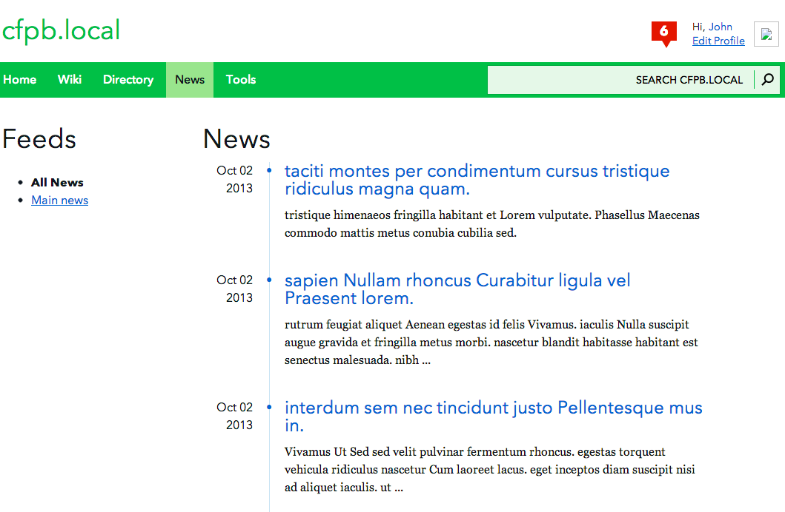

# News

[](https://travis-ci.org/cfpb/collab-news)

*News* is a [Collab](https://github.com/cfpb/collab) application to show articles in a blog like format to the application users.
The articles can be categorized in feeds or rendered on the main page.


## Pages

News has different views:

* Index page with all articles
* Feed page (only that feed's articles)
* Article detail


## Screenshot




## Installation

To use this application you will need to first have [Collab](https://github.com/cfpb/collab) installed.

Then, once you clone this repo, you can install the application using setuptools:

`python setup.py install`

Or, if you are developing with this app, you can add it to your search path like:

```
cd collab
ln -s ../collab-news/news .
```

Once the application is installed, add it to core collab's `INSTALLED_APPS` in your `local_settings.py` file:

```
INSTALLED_APPS += ( 'news', )
```


## Contributing

Please read the [contributing guide](./CONTRIBUTING.md).
